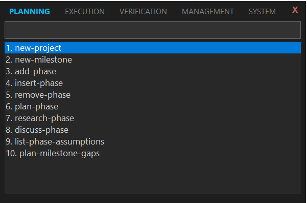

# SelectPaste

> A minimal, keyboard-centric command palette for Windows that lets you paste pre-defined text snippets instantly.




SelectPaste is a lightweight utility designed to improve productivity by reducing repetitive typing. Trigger it with a global hotkey, search for your snippet, and paste it into any active application.

## Key Features

*   **Global Hotkey**: Access your commands from anywhere (Default: `Shift + Alt + .`).
*   **Tabbed Navigation**: Organize commands into groups (e.g., General, Git, Code, Emails) and switch between them using arrow keys.
*   **Global Search**: Type to search across all command groups instantly.
*   **JSON Configuration**: Easy-to-edit `commands.json` and `settings.json` for full customization.
*   **System Tray Integration**: Runs silently in the background with quick access to configuration and controls.
*   **Portable**: No installation required; just run the single-file executable.

## Installation

1.  Download the latest release from the [Releases](https://github.com/dturkuler/SelectPaste/releases) page (or build from source).
2.  Extract the `SelectPaste` folder to a permanent location (e.g., `C:\Apps\SelectPaste`).
3.  Run `SelectPaste.exe`.

*Note: On first run, a popup will confirm you want to run the application in the background.*

## Configuration

SelectPaste uses simple JSON files located in the same directory as the executable.

### 1. Commands (`commands.json`)

Define your snippets here. Structure is a list of groups, each containing a list of commands.

```json
[
  {
    "name": "General",
    "description": "Daily essentials",
    "commands": [
      { 
        "label": "My Email", 
        "value": "user@example.com", 
        "description": "Pastes my work email" 
      }
    ]
  },
  {
    "name": "Git",
    "description": "Git shortcuts",
    "commands": [
      { "label": "git status", "value": "git status" },
      { "label": "git commit", "value": "git commit -m \"\"" }
    ]
  }
]
```

### 2. Settings (`settings.json`)

Customize the global hotkey combination.

```json
{
    "hotkey": "Shift + Alt + ."
}
```
*Supported modifiers: `Ctrl`, `Alt`, `Shift`, `Win`.*
*Supported keys: `A-Z`, `0-9`, `F1-F12`, and standard punctuation.*

## Usage

1.  **Launch**: Run `SelectPaste.exe`. Look for a dark "SP" icon in your system tray.
2.  **Trigger**: Press your hotkey (Default: `Shift + Alt + .`).
3.  **Search & Select**:
    *   **Type** to filter commands.
    *   **Up/Down Arrows** to select a command.
    *   **Left/Right Arrows** to switch usage tabs (if search box is empty or at cursor boundary).
4.  **Paste**: Press `Enter` to paste the selected snippet into your previous active window.
5.  **Exit/Config**: Right-click the tray icon to open the configuration folder or quit the app.

## Development

To build SelectPaste from source:

1.  Clone the repository.
2.  Navigate to the project directory:
    ```powershell
    cd selectpaste
    ```
3.  Build the project using the .NET SDK:
    ```powershell
    dotnet publish -r win-x64 -p:PublishSingleFile=true --self-contained -c Release
    ```
    The output will be in `bin\Release\net8.0-windows\win-x64\publish\`.

## Contributing

Contributions are welcome! Please feel free to submit a Pull Request.

## License

This project is licensed under the MIT License - see the LICENSE file for details.
