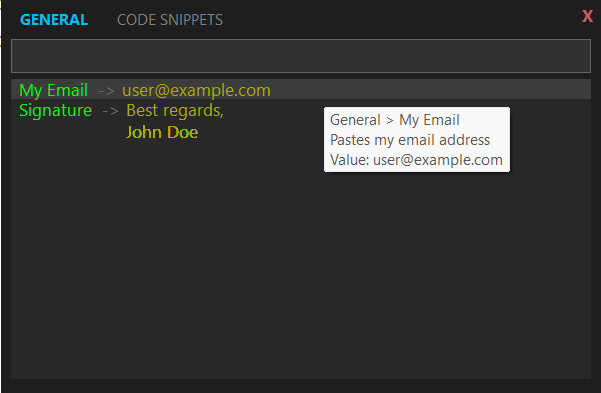

# SelectPaste

> A minimal, keyboard-centric command palette for Windows that lets you paste pre-defined text snippets instantly.


SelectPaste is a lightweight utility designed to improve productivity by reducing repetitive typing. Trigger it with a global hotkey, search for your snippet, and paste it into any active application.



## 🚀 Key Features

*   **Global Hotkey**: Access your commands from anywhere (Default: `Shift + Alt + .`).
*   **Favorites Tab**: Automatically generated group showing your most frequently used snippets.
*   **Smart Scrolling Header**: Tabs automatically scroll into view as you navigate with arrow keys.
*   **Resizable & Movable UI**: Drag the edges to resize or the header to move. The app **remembers your preferred layout** automatically.
*   **Fully Customizable Styling**: Control font size and colors (labels, values, categories) directly via `settings.json`.
*   **Frequency-Based Sorting**: The app learns your habits! Your most-used commands automatically move to the top of the search list.
*   **Intelligent Search**:
    *   **Tabbed Browsing**: View specific groups (General, Git, Emails) in a clean list.
    *   **Contextual Breadcrumbs**: When searching globally, items are marked with their category (e.g., `[GIT]`) so you know exactly what you're pasting.
*   **Value Preview**: See a preview of the text snippet (`Label -> Value`) right in the search results with custom coloring.
*   **System Tray Integration**: Runs silently in the background with quick access to configuration and controls.
*   **Portable & Reliable**: No installation required. Just run the `.exe` and it works.

## 📦 Installation

1.  Download the latest release from the [Releases](https://github.com/dturkuler/SelectPaste/releases) page.
2.  Extract the `SelectPaste` folder to a permanent location (e.g., `C:\Apps\SelectPaste`).
3.  Run `SelectPaste.exe`.

*Note: On first run, a popup will confirm you want to run the application in the background.*

## ⚙️ Configuration

SelectPaste uses simple JSON files located in the same directory as the executable.

### 1. Commands (`commands.json`)

Define your snippets here. Structure is a list of groups, each containing a list of commands.

```json
[
  {
    "name": "General",
    "commands": [
      { 
        "label": "My Email", 
        "value": "user@example.com", 
        "description": "Pastes my work email" 
      }
    ]
  }
]
```

### 2. Settings (`settings.json`)

Customize the global hotkey and visual appearance.

```json
{
    "hotkey": "Shift + Alt + .",
    "FontSize": 10,
    "LabelColor": "#00FF00",
    "ValueColor": "#AAAA00",
    "CategoryColor": "#777777",
    "WindowWidth": 600,
    "WindowHeight": 400
}
```
*Supported modifiers: `Ctrl`, `Alt`, `Shift`, `Win`. Colors use standard Hex codes.*

## ⌨️ Usage

1.  **Launch**: Run `SelectPaste.exe`. Look for a dark "SP" icon in your system tray.
2.  **Trigger**: Press your hotkey (Default: `Shift + Alt + .`).
3.  **Search & Select**:
    *   **Type** to filter commands (filters by label and value). Category labels appear automatically during search.
    *   **Up/Down Arrows** to select a command.
    *   **Left/Right Arrows** to switch between category tabs.
4.  **Paste**: Press `Enter` to paste the selected snippet into your previous active window.
5.  **Exit/Config**: Right-click the tray icon to open the configuration folder or quit the app.

## 🛠️ Development

To build SelectPaste from source:

1.  Clone the repository and navigate to the folder.
2.  Build using the .NET SDK:
    ```powershell
    dotnet publish -r win-x64 -p:PublishSingleFile=true --self-contained -c Release
    ```
    The output will be in `bin\Release\net8.0-windows\win-x64\publish\`.

## 📄 License

This project is licensed under the MIT License - see the LICENSE file for details.
